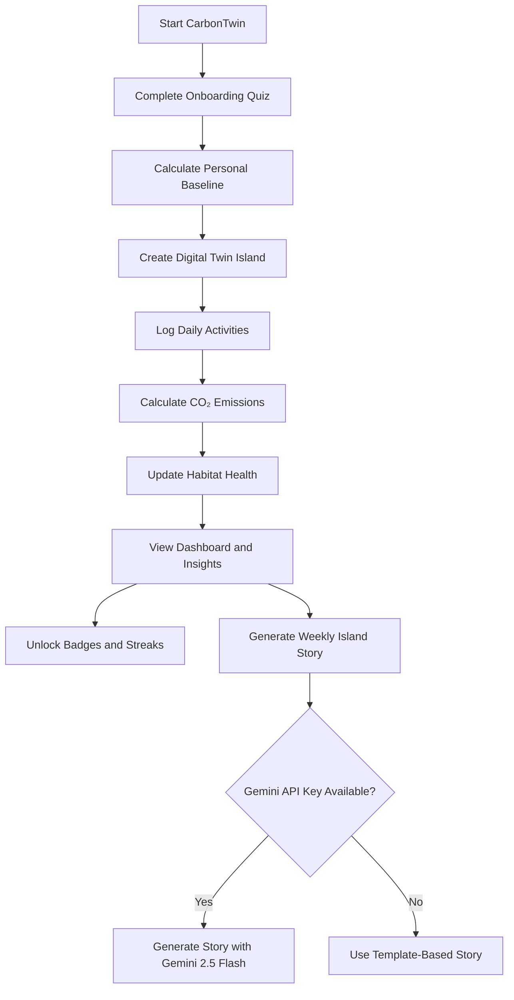
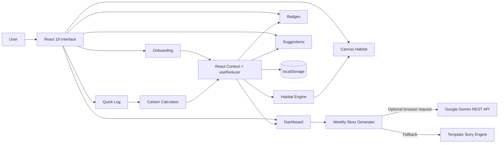

<div align="center">

# 🏝️ CarbonTwin

### Your lifestyle, visualized as a living digital island

CarbonTwin transforms everyday carbon-emission choices into an animated ecosystem that grows, clears, or struggles according to the user's habits.

<br />

[](https://react.dev/)
[](https://vite.dev/)
[](https://developer.mozilla.org/en-US/docs/Web/JavaScript)
[](https://ai.google.dev/)
[](https://vitest.dev/)
[](https://vercel.com/)

<br />

[Overview](#-overview) •
[Features](#-features) •
[Architecture](#-architecture) •
[Tech Stack](#-technology-stack) •
[Installation](#-local-setup) •
[Deployment](#-deploy-on-vercel)

</div>

---

## 📌 Overview

**CarbonTwin** is an interactive carbon-footprint tracker that replaces dry spreadsheets with a responsive digital ecosystem.

Users complete a short onboarding quiz, log daily activities, and watch an animated island react to their environmental impact. Lower-emission choices improve the island with clearer water, healthier vegetation, flowers, birds, and visual effects. Higher-emission choices increase smog, smoke, and ecosystem stress.

The project is currently a **frontend-only React application**. User data is stored locally in the browser using `localStorage`, while weekly AI stories can optionally be generated through the **Google Gemini REST API**.

---

## ✨ Features

| Feature | Description |
|---|---|
| 🧭 Interactive onboarding | A multi-step quiz estimates the user's initial daily carbon baseline from transport, diet, and energy habits. |
| 🏝️ Digital twin habitat | An HTML5 Canvas island visually responds to the user's environmental choices. |
| 📝 Quick activity logging | Log transport, meals, household energy usage, and shopping activities. |
| 🧮 Carbon calculation | Converts activities into estimated kilograms of CO₂ equivalent using stored emission factors. |
| 🌳 Reactive ecosystem | Green choices can improve trees, flowers, birds, water clarity, and habitat health. |
| 🌫️ Environmental feedback | Higher emissions can introduce smoke, smog, murky water, and reduced island health. |
| 🌅 Habitat simulator | Manually adjust time of day, wind speed, and the visibility of the eco-home. |
| 📸 Island export | Export the current island view as a PNG image. |
| 📊 Personal dashboard | Displays today's score, category breakdown, seven-day trend, averages, and personalized insights. |
| 🔥 Streak tracking | Calculates current and best daily logging streaks. |
| 🎖️ Achievement badges | Unlock badges based on logging consistency and environmental progress. |
| 💡 Personalized suggestions | Recommends focused improvements based on the user's highest-emission category. |
| 📖 AI weekly story | Generates a short narrative about the island using Gemini 2.5 Flash, with an offline template fallback. |
| 💾 Browser persistence | Saves user profile, logs, habitat state, badges, and progress in `localStorage`. |
| ♿ Accessible navigation | Includes semantic roles, labels, keyboard navigation, and responsive controls. |

---

## 🧭 Application Flow



<details>
<summary><strong>🌱 How the habitat reacts</strong></summary>

<br />

The habitat engine derives visual conditions from stored activity logs and streak data. Depending on the calculated footprint, the island can change its:

- Health score
- Tree and flower count
- Bird activity
- Smog intensity
- Water clarity
- Rainbow and particle effects

The Canvas animation is updated using `requestAnimationFrame` and reacts to browser size changes through `ResizeObserver`.

</details>

<details>
<summary><strong>📖 How weekly stories work</strong></summary>

<br />

When the user selects **Generate Story**, CarbonTwin prepares a summary containing:

- Weekly average CO₂
- Best and highest-emission days
- Island health
- Trees and flowers
- Smog level
- Water clarity

When a Gemini key is available, the frontend sends this summary to the Gemini 2.5 Flash REST API. If the API is unavailable or no key is configured, the application automatically generates a template-based story instead.

</details>

<details>
<summary><strong>💾 Where user data is stored</strong></summary>

<br />

CarbonTwin currently stores data in the user's browser using the Web Storage API.

Main storage keys include:

```text
carbontwin_v1
ct_unlocked_badges
gemini_api_key
```

Because there is no backend database:

- Data is limited to the current browser and device.
- Clearing browser data removes saved progress.
- Different users do not share a common database.
- The badges screen is a local achievement system, not a global online leaderboard.

</details>

---

## 🏗️ Architecture



### Current request flow

```text
Browser-based React application
        │
        ├── React Context and useReducer
        ├── Carbon calculation utilities
        ├── Canvas habitat engine
        ├── localStorage persistence
        └── Optional direct Gemini REST API request
```

> CarbonTwin currently has no Express, FastAPI, Flask, database server, or custom backend API.

---

## 🛠️ Technology Stack

### Core frontend

| Technology | Usage |
|---|---|
| JavaScript ES6+ | Application logic and utility functions |
| JSX | Declarative React component structure |
| React 19 | User interface and component architecture |
| React DOM | Browser rendering |
| React Context API | Global state distribution |
| `useReducer` | Predictable application state updates |
| React Hooks | Local state, memoization, effects, references, and callbacks |
| Vanilla CSS | Responsive styling, glassmorphism, animations, and layouts |

### Graphics and browser APIs

| Technology | Usage |
|---|---|
| HTML5 Canvas | Animated digital twin island |
| `requestAnimationFrame` | Smooth animation loop |
| `ResizeObserver` | Responsive Canvas resizing |
| Page Visibility API | Animation behavior based on tab visibility |
| Web Storage API | Local user-data persistence |
| CSS keyframes | UI transitions and visual effects |

### Artificial intelligence

| Technology | Usage |
|---|---|
| Google Gemini 2.5 Flash | Optional AI-generated weekly island stories |
| Gemini REST API | Called with the browser Fetch API |
| Template story engine | Reliable fallback when Gemini is unavailable |

> `@google/generative-ai` is installed as a dependency, but the current application code calls Gemini through `fetch()` rather than importing the SDK.

### Development and quality tools

| Tool | Usage |
|---|---|
| Node.js | Runs the frontend development and build tools |
| Vite 8 | Development server and production bundler |
| Vitest | Unit and component testing |
| React Testing Library | React component behavior testing |
| JSDOM | Browser-like testing environment |
| ESLint | Static code-quality checks |

---

## 📁 Project Structure

```text
carbon/
├── public/
│   └── favicon.svg
├── src/
│   ├── components/
│   │   ├── Dashboard/
│   │   │   ├── Dashboard.jsx
│   │   │   ├── Dashboard.css
│   │   │   ├── WeeklyStory.jsx
│   │   │   └── WeeklyStory.css
│   │   ├── Habitat/
│   │   │   ├── HabitatCanvas.jsx
│   │   │   ├── SidebarWidgets.jsx
│   │   │   └── habitatEngine.js
│   │   ├── Leaderboard/
│   │   │   └── Leaderboard.jsx
│   │   ├── Onboarding/
│   │   │   ├── OnboardingQuiz.jsx
│   │   │   └── OnboardingQuiz.test.jsx
│   │   ├── QuickLog/
│   │   │   ├── QuickLog.jsx
│   │   │   └── MicroAction.jsx
│   │   ├── Suggestions/
│   │   │   └── Suggestions.jsx
│   │   └── UI/
│   │       ├── BottomNav.jsx
│   │       ├── Confetti.jsx
│   │       └── Toast.jsx
│   ├── context/
│   │   └── AppContext.jsx
│   ├── data/
│   │   └── emissionFactors.js
│   ├── utils/
│   │   ├── carbonCalculator.js
│   │   ├── insightGenerator.js
│   │   ├── microActionGenerator.js
│   │   └── streakCalculator.js
│   ├── App.jsx
│   ├── App.css
│   ├── index.css
│   └── main.jsx
├── .env.example
├── eslint.config.js
├── index.html
├── package.json
├── package-lock.json
└── vite.config.js
```

---

## 🚀 Local Setup

### Prerequisites

Install the following before running the project:

- [Node.js](https://nodejs.org/) `^20.19.0` or `>=22.12.0`
- npm
- Git

### 1. Clone the repository

```bash
git clone https://github.com/rudrakshia30/carbon-emission-tracker.git
cd carbon-emission-tracker
```

If `package.json` is inside a nested `carbon` folder, enter it:

```bash
cd carbon
```

### 2. Install dependencies

```bash
npm install
```

### 3. Start the development server

```bash
npm run dev
```

Open the local URL shown in the terminal, usually:

```text
http://localhost:5173
```

---

## 🤖 Optional Gemini Configuration

CarbonTwin works without an API key by using its built-in template story generator.

For local Gemini testing, create a `.env` file beside `package.json`:

```env
VITE_GEMINI_API_KEY=your_gemini_api_key_here
```

Then restart the development server:

```bash
npm run dev
```

You can also enter a key through the **Set Gemini API Key** section in the weekly-story card. The key entered there is stored in the current browser's `localStorage`.

> [!WARNING]
> Variables beginning with `VITE_` are bundled into frontend code. Do not treat `VITE_GEMINI_API_KEY` as secret in a public production deployment. A production-ready version should call Gemini through a serverless function or backend API.

---

## 📜 Available Commands

| Command | Purpose |
|---|---|
| `npm run dev` | Start the Vite development server |
| `npm run build` | Create an optimized production build in `dist/` |
| `npm run preview` | Preview the production build locally |
| `npm run lint` | Run ESLint checks |
| `npm test` | Run the Vitest test suite |

---

## 🧪 Testing

The project includes tests for important application behavior, including:

- Onboarding quiz interactions
- Carbon calculations
- Streak calculations

Run all tests with:

```bash
npm test
```

Run code-quality checks with:

```bash
npm run lint
```

Verify the production build with:

```bash
npm run build
```

---
### Method 2: Deploy using the Vercel CLI

Install the CLI:

```bash
npm install -g vercel
```

Log in and deploy:

```bash
vercel
```

Create a production deployment:

```bash
vercel --prod
```

### Push future updates

```bash
git add .
git commit -m "Update CarbonTwin"
git push origin main
```

Vercel will automatically rebuild the connected project after each push.

---

## 🔐 Security and Data Notes

- CarbonTwin currently stores application data in `localStorage`.
- There is no server-side authentication or cloud database.
- User progress does not automatically sync between devices.
- A Gemini key entered in the interface is saved in the browser.
- A `VITE_` environment variable is visible in the built frontend bundle.
- Sensitive production API keys should be moved to a backend or Vercel serverless function.

---

## 🌍 Carbon Methodology

Emission factors are defined in:

```text
src/data/emissionFactors.js
```

The project references data categories and methodologies associated with sources such as:

- UK DEFRA/DESNZ greenhouse-gas conversion factors
- US EPA greenhouse-gas emission factors
- IPCC climate assessment data
- Poore and Nemecek's food lifecycle research
- Our World in Data
- Carbon Trust lifecycle studies

> CarbonTwin provides educational estimates and should not be treated as an audited professional carbon-accounting platform.

---

## 🗺️ Future Improvements

- Add a secure serverless endpoint for Gemini requests
- Add user authentication
- Store profiles and logs in a cloud database
- Synchronize progress across devices
- Add real shared leaderboards
- Add historical monthly and yearly reports
- Add CSV and PDF report export
- Add location-aware electricity emission factors
- Add PWA and offline installation support
- Add more achievements and environmental challenges
- Improve automated accessibility testing

---

## 🤝 Contributing

Contributions, suggestions, and bug reports are welcome.

```bash
# Fork the repository and clone your fork
git clone https://github.com/your-username/carbon-emission-tracker.git

# Create a feature branch
git checkout -b feature/your-feature-name

# Commit your changes
git add .
git commit -m "Add your feature"

# Push the branch
git push origin feature/your-feature-name
```

Then open a pull request describing your changes.

---

## 👩‍💻 Author

<div align="center">

### Rudrakshi Agarwal

B.Tech Computer Science and Engineering student at IIIT Delhi  
Aspiring Software and AI Engineer

[](https://github.com/rudrakshia30)
[](mailto:rudrakshia30@gmail.com)

</div>

---

<div align="center">

### 🌱 Small choices shape the island. Consistent choices shape the future.

If you found this project useful, consider giving the repository a ⭐

</div>


## 📚 Scientific Citations & Methodology

All emission calculations and benchmarks are backed by rigorous carbon methodologies:
*   **Transportation & Energy Factors**: Calculated based on the **UK DEFRA/DESNZ GHG Conversion Factors (2024)** and the **US EPA Greenhouse Gas Emission Factors Hub**.
*   **Dietary Impact & Food Offsets**: Factored from **Poore & Nemecek (Science 2018)** meta-analysis of food lifecycle assessments (LCA).
*   **National Benchmarks**: Daily averages and target thresholds are benchmarked using **IEA per-capita statistical databases**, contrasting high-income targets (22 kg/day) against India's national per-capita average baseline (~5.6 kg/day).
